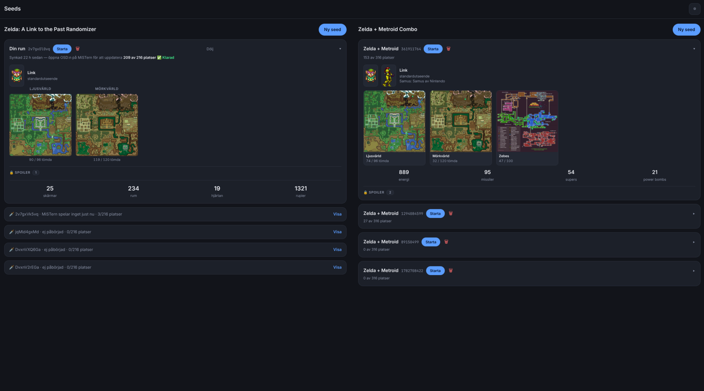
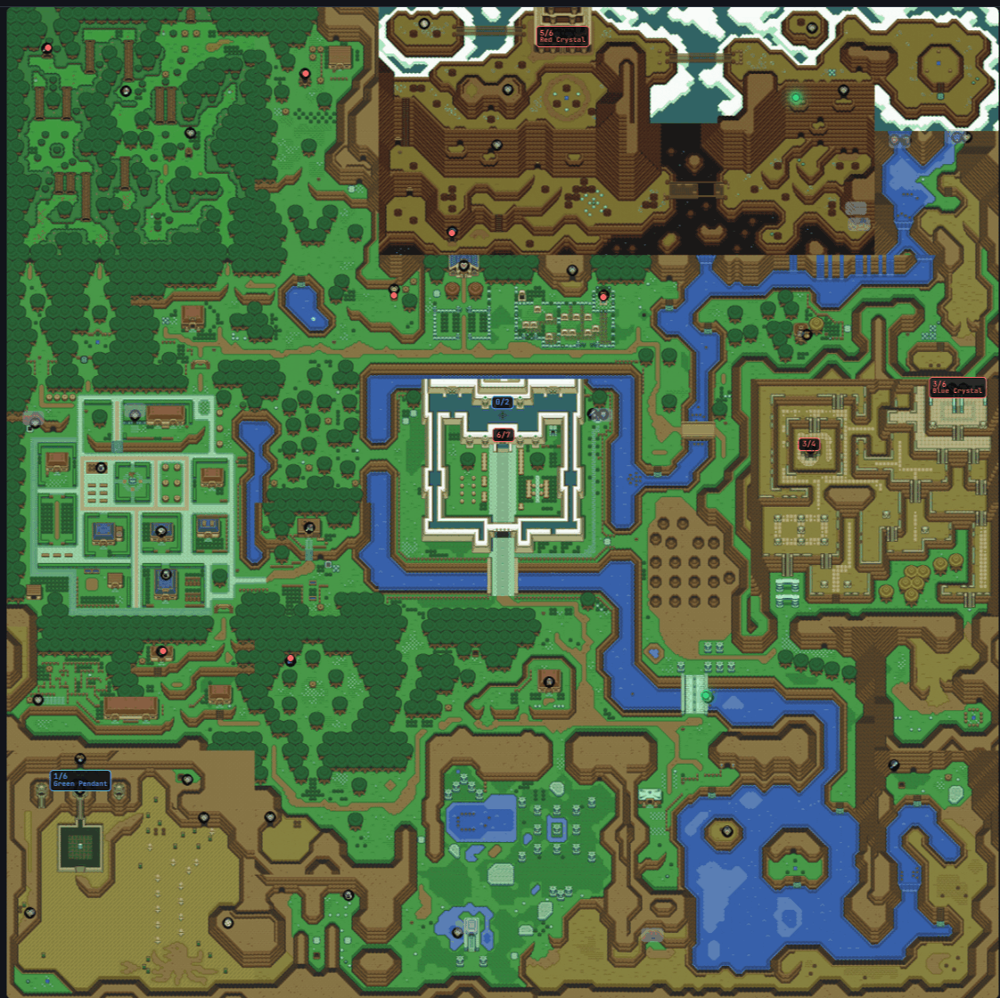
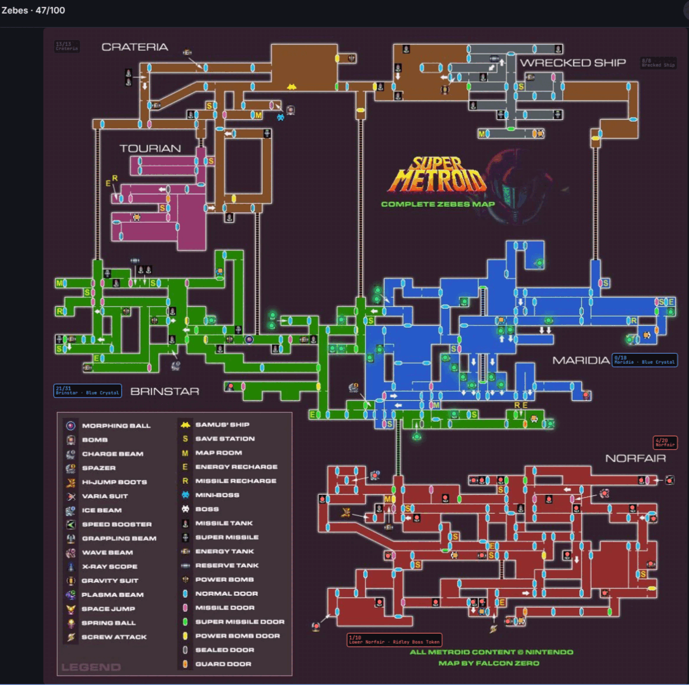
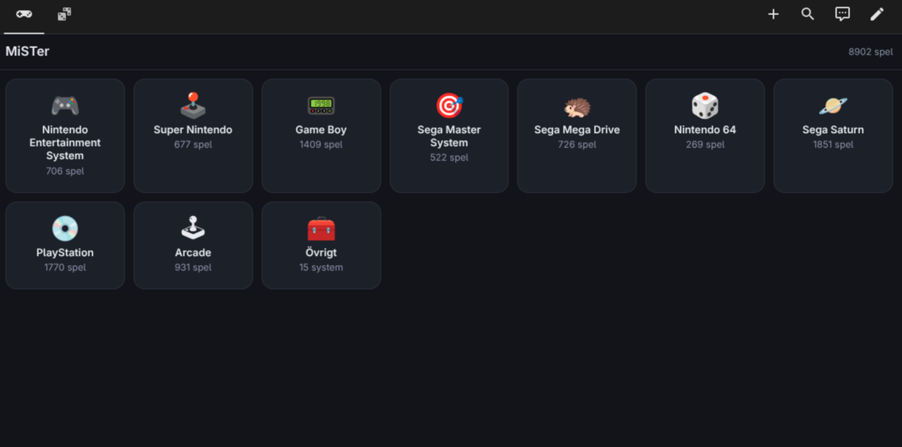

# Randomizer and game browser for MiSTer FPGA

*[Svenska](README.sv.md) · English*

Two things that share one small web server running on the MiSTer, both
built to be used from a phone:

**The seed page** — a seed generator and a spoiler-free tracker for *A
Link to the Past Randomizer* and *SMZ3* (Super Metroid + ALTTP combined).
The map shows where you have been and — the whole point — what you can
actually reach with what you are carrying. The reachability logic is
**Archipelago's own**, the same rule set that generated the seed.

**The game browser** — every game on your MiSTer as a list on your phone.
Tap a game and the MiSTer switches core and launches it. Systems with only
a handful of games are collected behind a single tile so the start page
stays readable.

> **No ROMs are included, and none can be.** The browser lists what is
> already on your own SD card — if you have no games there, you get an
> empty list. The same goes for the base ROMs used for seed generation:
> they must be your own dumps. See *Your own ROMs* below.


<p align="center">
  
</p>

<p align="center">
  
  
</p>

<p align="center">
  <em>Green is reachable now, red is locked, grey is done. The badges count the
  chests left in each dungeon. Shown in Swedish here - English, Spanish, French
  and Polish ship with it too.</em>
</p>

<p align="center">
  
</p>

---

## What you need

**Two machines, no more:**

1. A **MiSTer FPGA** on your network.
2. A **Home Assistant** server — *Home Assistant OS* or *Supervised*.
   This is a hard requirement: HA Container and HA Core cannot install
   add-ons, and the logic is an add-on.

### Your own ROMs

The game browser needs nothing at all — it shows the games you already
have under `/media/fat/games/`.

**Seed generation** needs two headerless dumps that you must own and dump
yourself:

```
alttp.smc   1 048 576 bytes   md5 03a63945398191337e896e5771f77173
sm.smc      3 145 728 bytes   md5 21f3e98df4780ee1c667b84e57d88675
```

(Zelda 3 Japanese 1.0 and Super Metroid JU respectively.) The installer
looks for them among your own SNES ROMs — inside `.zip` files too, and
even if they carry a 512-byte header — so usually you do not have to do
anything.

---

## Installation

The two halves are independent and can be installed in any order. Start
with Home Assistant, though: then the MiSTer installer can verify that the
logic answers before it declares itself finished.

### 1. Home Assistant

1. **Settings → Add-ons → Add-on Store**
2. Top-right menu → **Repositories** → paste:
   ```
   https://github.com/frystien-png/mister-randomizer
   ```
3. Close the dialog, find **SMZ3 and ALTTPR logic** → **Install**
4. **Configuration** tab → enter the MiSTer's IP address → **Save**
5. **Start**

The first build takes a few minutes — Archipelago is downloaded and
trimmed at that point.

*Without GitHub:* copy the `smz3-logic/` folder into Home Assistant's
`/addons/` (via the Samba or SSH add-on), pick **Check for updates** in
the add-on store menu, and it shows up under **Local add-ons**.

### 2. MiSTer

Put **one single file** in `/media/fat/Scripts/` on the SD card — it
fetches the rest itself:

```
https://raw.githubusercontent.com/frystien-png/mister-randomizer/main/mister/Randomizer_install.sh
```

Then run **Scripts → Randomizer_install** from the MiSTer menu.

*Without internet on the MiSTer:* put `randomizer-payload.tar.gz` next to
the script and it is used instead of the download.

The installer finds Home Assistant on its own, lays out the files, asks
which language you want, creates the menu entries, sets up autostart and
starts the server. It is safe to re-run at any time — your notes and map
markers are left alone, and an existing setup is not overwritten.

---

## Language

The pages are translated when they are served. English is the default;
the installer asks, and the choice is stored in
`.mistergames/randomizer.conf`:

```
MISTER_LANG="en"
```

Change that line and restart the MiSTer to switch language — no need to
reinstall.

| Code | Language |
|---|---|
| `en` | English *(the source language, and the default)* |
| `es` | Español |
| `fr` | Français |
| `pl` | Polski |
| `sv` | Svenska |

### Adding your own language

Everything you need is on the MiSTer already, in
`/media/fat/Scripts/.mistergames/lang/`:

1. Copy `TEMPLATE.json` to `<code>.json` — for example `de.json`.
2. Set `__name` to the language's own name (`"Deutsch"`).
3. Translate the **right-hand** side of every line. The left-hand side is
   the English source string and must never be changed — that is the key
   the page is matched on.
4. Anything you leave out simply stays in English, so a half-finished
   translation is perfectly usable.
5. Run the installer again and pick your language from the menu — it lists
   whatever files are in the folder.

Two tools sit next to the language files:

```
python3 lang_check.py          check every language file
python3 lang_extract.py        regenerate the template from the pages
```

`lang_check.py` is the one worth running. It reports how much of the
template you have covered, and it fails on the two mistakes that actually
break something: a key that does not occur in the pages (usually a typo —
a missing trailing space is enough), and a key that is also used as a CSS
class or a file name, which would translate the page's plumbing instead of
its text.

Item names (Bow, Hookshot, Morph Ball) stay in **English in every
language** unless a translation deliberately changes them. Randomizer
communities use the English names regardless of what language they speak,
and a player searching for "Hookshot" should find it. The Swedish file is
the one exception - it translates them.

Translations may contain apostrophes and quotes — `l'écran`, `¿Qué?` —
they are escaped for the position they land in.

---

## Using it

| | |
|---|---|
| **Game browser** | `http://<mister-ip>:8182/` |
| **Seed page** | `http://<mister-ip>:8182/seeds` |
| **Back to the menu** | the `⏏ Menu` button in the header, shown while a game is running |
| **New ALTTPR seed** | MiSTer menu → Scripts → `ALTTPR_new_seed` |
| **New SMZ3 seed** | MiSTer menu → Scripts → `SMZ3_new_seed` |

Add both pages to Home Assistant as **webpage** cards with the MiSTer's
address and you can reach them from your phone.

Games in `.zip` archives work the same as loose files — the launcher
resolves the path into the archive, which an MGL requires. A collection
mixing both is fine.

The browser re-indexes the game folders every fifteen minutes, and
immediately if you call `http://<mister-ip>:8182/api/rescan`. New games
appear on their own, no restart needed.

---

## Live reading (SNI)

The installer offers to set up **SNI**, which lets the server read the
game's memory directly. The map then updates **while you play** instead of
only when you open the OSD menu.

It builds on support that already exists in MiSTer's official SNES core
(since March 2026) and in the main binary (since April). What is missing
is the daemon [`snid`](https://github.com/NobodyNada/snid), which the
installer downloads and verifies against a known checksum.

**One step you must do yourself, once:** start a SNES game, open the OSD
menu and choose **UART MODE → SNI**. The mode is sent to the core by the
menu, not by a file, so it cannot be done for you. The choice is saved per
core and restored automatically afterwards.

Check that it works with `curl http://<mister>:8182/api/smz3` — the `live`
field should be `true` for the running seed.

⚠️ On a MiSTer that has been around a while, the system file
`/usr/sbin/uartmode` may be too old and lack the SNI mode. The installer
detects this and asks before touching anything; the original is saved as
`uartmode.original` on the SD card. A future firmware update can overwrite
the change — just run the installer again.

Skipping SNI changes nothing else; the save file remains the source.

---

## Things to know up front

**Without SNI the save file is only written when you open the OSD menu.**
The MiSTer flushes the game's save memory to the SD card at that moment —
not continuously. The tracker therefore cannot see anything you have done
since you last opened the menu. Habit worth forming: **open and close the
OSD after you save.**

For the same reason: **do not launch a new game from the browser in the
middle of a run** without opening the OSD first. The core switch happens
immediately and everything since the last flush is gone — that applies to
all games, not just randomizer seeds. It cannot be fixed in software:
`/dev/MiSTer_cmd` only understands `load_core` and a handful of video and
audio commands, with no way to open the menu or request a save.

**Give both machines static addresses** in your router. If either one
changes IP they stop finding each other, and that shows up as a map that
does not update — not as an error message.

---

## If something is wrong

| Symptom | Likely cause |
|---|---|
| The page does not respond at all | The server is not running. Run `Randomizer_install` again. |
| A game starts but the screen stays black | Almost always the MiSTer's own video settings, not this. A fixed `video_mode` together with `vsync_adjust=1` outputs 50 Hz for PAL games, and many TVs refuse that mode - the game is running, you just cannot see it. Check the save folder: if `saves/<core>/<game>.eep` or `.sra` appeared, the ROM did load. Fix with `vsync_adjust=0` in `MiSTer.ini`. |
| The map shows but the dots have no colour | The add-on is not answering. Check its log and `mister_ip`. |
| The map does not update after playing | You have not opened the OSD. The save file has not been flushed. |
| Parts of the page are in Swedish | That language file does not translate those strings yet. Run `lang_check.py`. |
| "Wrong ROM" for the right game | You have a different dump. Check the md5 against the list above. |
| Nothing happens after rebooting the MiSTer | `user-startup.sh` must not be named `_user-startup.sh`. |
| The download fails on the MiSTer | Old certificate list. Run **Scripts → update_all** once, or put `randomizer-payload.tar.gz` next to the script. |

Log on the MiSTer: `/tmp/mistergames.log`.
Logic service: `curl http://<home-assistant>:8183/health`.

---

## What is *not* included

**No ROMs, no disc images, nothing copyrighted.** The package is code and
data tables. That this holds is enforced by `check_payload.sh`, which
runs on every build and refuses to pack anything that looks like a ROM.
You can run it yourself on the file you downloaded:

```
./check_payload.sh randomizer-payload.tar.gz
```

It rejects ROM extensions, anything in `randomizer/base/` except the note,
files over 400 K, binaries of unknown type, secrets, and user state that
is not empty. It also refuses **private network details** — RFC 1918
addresses, MAC addresses, share names, tokens and keys — so that nobody's
home network leaks out with a release.

Also outside the package: core status pushed to Home Assistant
(`ha_push.py`) and the NAS mounting of PS1/Saturn discs (`nas_mount.sh`).
The browser lists whatever is mounted under `/media/fat/games/`, so your
own network mount works — but setting it up is on you.

If you already have your own `page.py`, the installer leaves it alone and
puts its own next to it as `page.py.ny`.

---

---

## Licence and credits

This project is **MIT licensed** — see [LICENSE](LICENSE). Use it, change it,
redistribute it; keep the copyright notice and expect no warranty.

It stands on other people's work:

| | |
|---|---|
| [Archipelago](https://github.com/ArchipelagoMW/Archipelago) (MIT) | the reachability logic itself. The add-on pins it to one exact commit and answers with its rules, not with rules of ours. |
| [hutchch/ALTTPR-Tracker](https://github.com/hutchch/ALTTPR-Tracker) (MIT) | the chest-flag table that maps each ALTTP location to its exact SRAM flag, and the way the medallion choice is handled. |
| [TotalSMZ3](https://github.com/tewtal/SMZ3Randomizer) | the SMZ3 logic and the ROM layout the combo build follows. |
| [pyz3r](https://github.com/tcprescott/pyz3r) (Apache-2.0) | three vendored files for applying ALTTPR patches. Modified: aiohttp swapped for urllib, because the MiSTer has no pip. Licence and NOTICE ship inside the package. |
| [bps](https://pypi.org/project/bps/) (WTFPL) | vendored BPS patching. COPYING ships inside the package. |
| [snid](https://github.com/NobodyNada/snid) by NobodyNada | the daemon that makes live reading of SNES memory possible. Downloaded on request, never bundled. |
| alttpr.com and samus.link | seed generation and the sprites. Nothing but patch data is exchanged; no ROM is ever uploaded. |
| The screenshots | The maps behind the dots are the games' own artwork (© Nintendo); the Zebes map is by Falcon Zero. They illustrate the tracker - no game data ships with this project. |

**No game data of any kind is included** — see the *What is not included*
section above.

## For anyone building on this

```
├── repository.yaml          must sit in the root - HA looks for it there
├── smz3-logic/              the add-on itself
│   ├── config.yaml          options, ports, architectures
│   ├── Dockerfile           fetches and trims Archipelago
│   └── logic/               reachd.py, smz3_logic.py, alttp_locmap.py
├── mister/
│   ├── Randomizer_install.sh
│   └── randomizer-payload.tar.gz
├── build_payload.sh         rebuilds the payload from a running MiSTer
└── check_payload.sh         the guard: no ROMs, no secrets, no LAN details
```

The MiSTer is the source of truth for the payload: the code lives there
and `build_payload.sh` copies it home, leaving out everything personal — ROMs,
passwords, private notes. It refuses to run without an address:

```
./build_payload.sh 192.168.1.50
echo 192.168.1.50 > .mister-ip     # git-ignored, remembered for next time
```

Nothing is packed until the guard has had its say. If it finds something,
the build stops and the existing tarball is left untouched.

The installer can be rehearsed without touching a real setup:

```
FAT=/tmp/prov ./Randomizer_install.sh
```

Nothing running is touched and everything lands under `/tmp/prov`.
