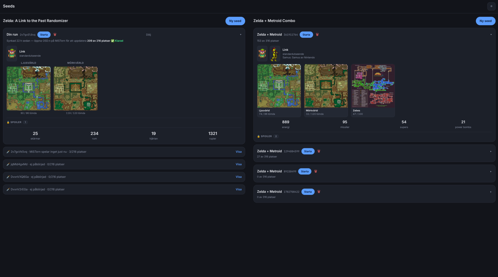
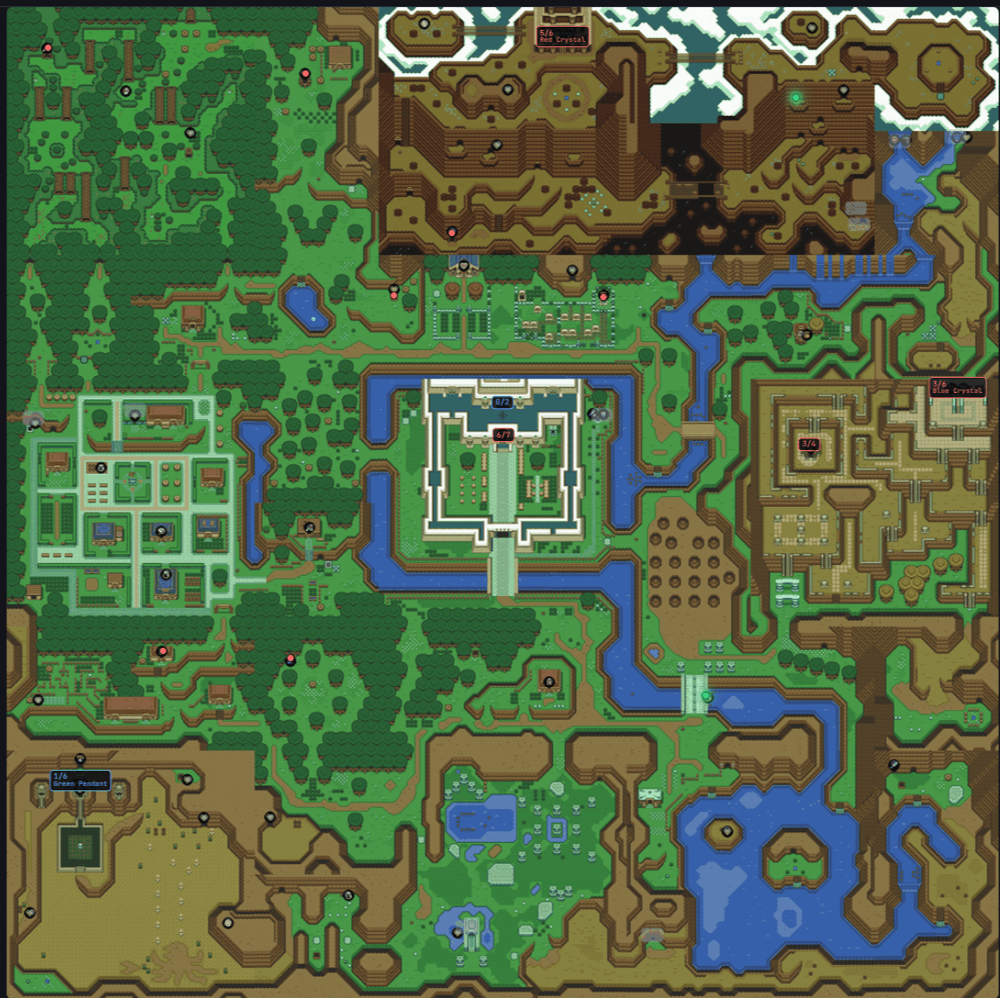
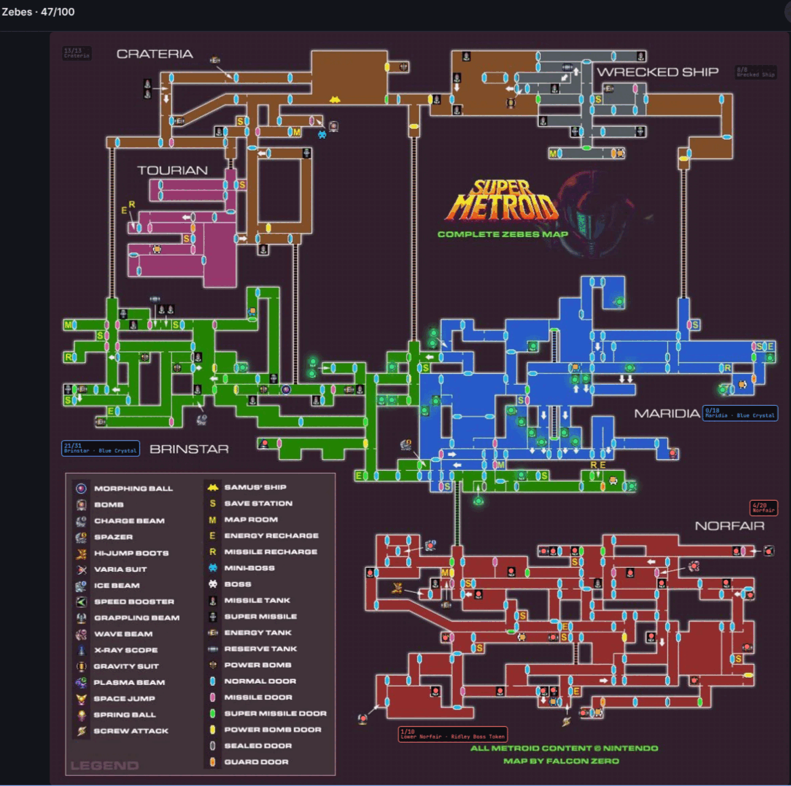
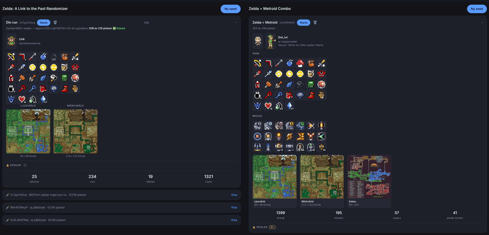
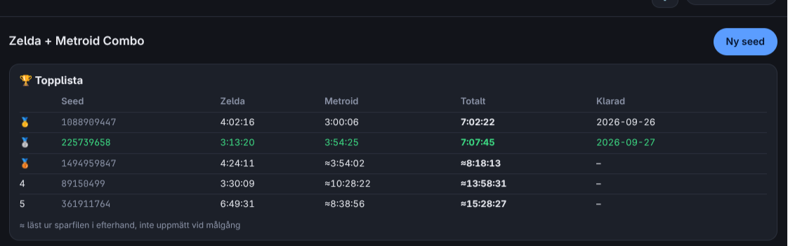
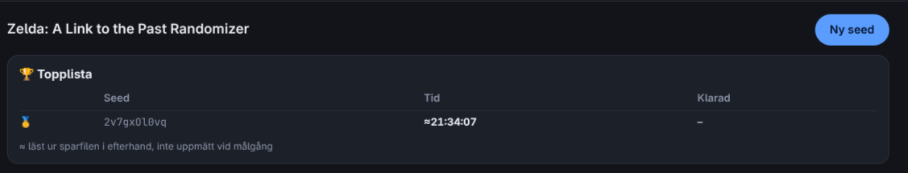
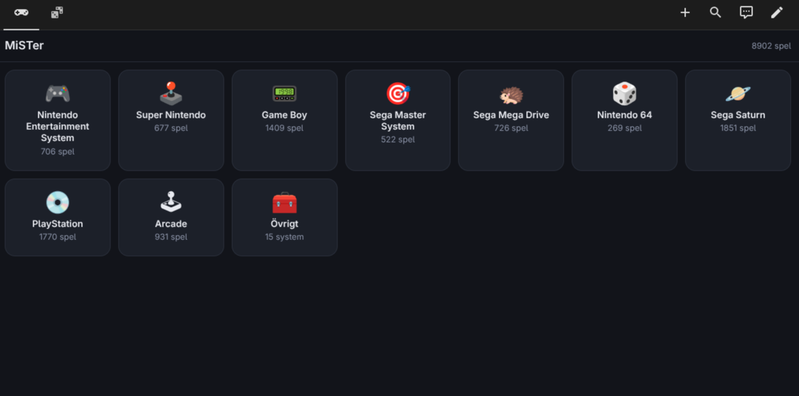

# Randomizer i przeglądarka gier dla MiSTer FPGA

*[English](README.md) · [Español](README.es.md) · [Français](README.fr.md) · Polski · [Svenska](README.sv.md)*

Dwa narzędzia, które dzielą jeden mały serwer WWW działający na MiSTerze,
oba zaprojektowane do obsługi z telefonu:

**Strona seedów** — generator seedów i tracker bez spoilerów dla *A Link
to the Past Randomizer* i *SMZ3* (Super Metroid + ALTTP w jednym). Mapa
pokazuje, gdzie już byłeś, i — o to właśnie chodzi — dokąd naprawdę
możesz dotrzeć z tym, co masz przy sobie. Logika dostępności to **logika
samego Archipelago**, ten sam zestaw reguł, który wygenerował seed.

**Przeglądarka gier** — wszystkie gry z twojego MiSTera jako lista na
telefonie. Dotknij gry, a MiSTer zmieni core i ją uruchomi. Systemy z
zaledwie kilkoma grami są zebrane za jednym kafelkiem, żeby strona
startowa pozostała czytelna.

> **Żadne ROM-y nie są dołączone i nie mogą być.** Przeglądarka pokazuje
> to, co już jest na twojej karcie SD — jeśli nie masz tam gier, lista
> będzie pusta. To samo dotyczy bazowych ROM-ów do generowania seedów:
> muszą to być twoje własne zrzuty. Zobacz *Twoje własne ROM-y* poniżej.


<p align="center">
  
</p>

<p align="center">
  
  
</p>

<p align="center">
  <em>Zielony — osiągalne teraz, czerwony — zablokowane, szary — zrobione.
  Plakietki liczą skrzynie pozostałe w każdym lochu. Bossowie to romby,
  które szarzeją w chwili, gdy padną. Tutaj pokazane po szwedzku — w
  zestawie są też angielski, hiszpański, francuski i polski.</em>
</p>

<p align="center">
  
</p>

<p align="center">
  <em>To, co zebrałeś, podświetlone po znalezieniu, z liczbą w rogu — a
  karta SMZ3 pokazuje obie gry. Ikony na obrazku to prywatna kopia gracza
  — zobacz <a href="#czego-nie-ma-w-zestawie">Czego nie ma w zestawie</a>.</em>
</p>

<p align="center">
  
  
</p>

<p align="center">
  <em>Ranking dla każdej gry, najszybszy ukończony seed na górze. SMZ3
  pokazuje czas każdej połowy obok sumy — te same czasy, które wyświetlają
  napisy końcowe. „≈” oznacza czas odczytany później z pliku zapisu, a nie
  na mecie.</em>
</p>

<p align="center">
  
</p>

---

## Czego potrzebujesz

**Dwóch maszyn, nic więcej:**

1. **MiSTer FPGA** w twojej sieci.
2. Serwer **Home Assistant** — *Home Assistant OS* lub *Supervised*.
   To twardy wymóg: HA Container i HA Core nie potrafią instalować
   dodatków, a logika jest dodatkiem.

### Twoje własne ROM-y

Przeglądarka gier nie potrzebuje niczego — pokazuje gry, które już masz w
`/media/fat/games/`.

**Generowanie seedów** wymaga dwóch zrzutów bez nagłówka, które musisz
posiadać i zrzucić samodzielnie:

```
alttp.smc   1 048 576 bajtów   md5 03a63945398191337e896e5771f77173
sm.smc      3 145 728 bajtów   md5 21f3e98df4780ee1c667b84e57d88675
```

(Odpowiednio Zelda 3 japońska 1.0 i Super Metroid JU.) Instalator szuka
ich wśród twoich własnych ROM-ów SNES — także w plikach `.zip` i nawet
jeśli mają 512-bajtowy nagłówek — więc zwykle nie musisz nic robić.

---

## Instalacja

Obie połowy są niezależne i można je instalować w dowolnej kolejności.
Mimo to zacznij od Home Assistant: wtedy instalator na MiSTerze może
sprawdzić, czy logika odpowiada, zanim uzna, że skończył.

### 1. Home Assistant

1. **Ustawienia → Dodatki → Sklep z dodatkami**
2. Menu w prawym górnym rogu → **Repozytoria** → wklej:
   ```
   https://github.com/frystien-png/mister-randomizer
   ```
3. Zamknij okno, znajdź **SMZ3 and ALTTPR logic** → **Zainstaluj**
4. Karta **Konfiguracja** → wpisz adres IP MiSTera → **Zapisz**
5. **Uruchom**

Pierwsza kompilacja trwa kilka minut — wtedy pobierane i odchudzane jest
Archipelago.

*Bez GitHuba:* skopiuj folder `smz3-logic/` do `/addons/` w Home
Assistant (przez dodatek Samba lub SSH), wybierz **Sprawdź aktualizacje**
w menu sklepu z dodatkami, a pojawi się w sekcji **Dodatki lokalne**.

### 2. MiSTer

Umieść **jeden jedyny plik** w `/media/fat/Scripts/` na karcie SD — resztę
pobierze sam:

```
https://raw.githubusercontent.com/frystien-png/mister-randomizer/main/mister/Randomizer_install.sh
```

Następnie uruchom **Scripts → Randomizer_install** z menu MiSTera.

*Bez internetu na MiSTerze:* połóż `randomizer-payload.tar.gz` obok
skryptu, a zostanie użyty zamiast pobierania.

Instalator sam znajduje Home Assistant, rozkłada pliki, pyta, jakiego
języka chcesz, tworzy pozycje w menu, konfiguruje autostart i uruchamia
serwer. Można go bezpiecznie uruchamiać ponownie w dowolnej chwili —
twoje notatki, znaczniki na mapie i czasy ukończenia pozostają nietknięte,
a istniejąca konfiguracja nie jest nadpisywana.

---

## Język

Strony są tłumaczone w chwili ich wysyłania. Domyślnym językiem jest
angielski; instalator pyta o wybór, a ten zapisywany jest w
`.mistergames/randomizer.conf`:

```
MISTER_LANG="pl"
```

Zmień tę linię i uruchom MiSTera ponownie, aby zmienić język — nie trzeba
niczego reinstalować.

| Kod | Język |
|---|---|
| `en` | English *(język źródłowy i domyślny)* |
| `es` | Español |
| `fr` | Français |
| `pl` | Polski |
| `sv` | Svenska |

### Dodawanie własnego języka

Wszystko, czego potrzebujesz, jest już na MiSTerze, w
`/media/fat/Scripts/.mistergames/lang/`:

1. Skopiuj `TEMPLATE.json` do `<kod>.json` — na przykład `de.json`.
2. Ustaw `__name` na nazwę języka w tym języku (`"Deutsch"`).
3. Przetłumacz **prawą** stronę każdej linii. Lewa strona to angielski
   tekst źródłowy i nigdy nie wolno jej zmieniać — to klucz, po którym
   dopasowywana jest strona.
4. Wszystko, czego nie przetłumaczysz, zostaje po angielsku, więc nawet
   niedokończone tłumaczenie w pełni się nadaje.
5. Uruchom instalator ponownie i wybierz swój język z menu — pokazuje
   wszystkie pliki znajdujące się w folderze.

Obok plików językowych są dwa narzędzia:

```
python3 lang_check.py          sprawdza wszystkie pliki językowe
python3 lang_extract.py        odtwarza szablon na podstawie stron
```

Warto uruchamiać `lang_check.py`. Pokazuje, jaką część szablonu
pokryłeś, i zgłasza błąd przy dwóch pomyłkach, które naprawdę coś psują:
kluczu, który nie występuje na stronach (prawie zawsze literówka —
wystarczy brak spacji na końcu), oraz kluczu, który jest też używany jako
klasa CSS lub nazwa pliku, co przetłumaczyłoby mechanikę strony zamiast
jej tekstu.

Nazwy przedmiotów z Zeldy (Łuk, Hak, Księżycowa perła) są tłumaczone we
wszystkich językach. Nazwy z Super Metroida (Morph Ball, Screw Attack,
missiles) zostają **wszędzie po angielsku**: sama gra nigdy nie została
przetłumaczona, a gracze znają te nazwy po angielsku, niezależnie od tego,
jakim językiem mówią.

Tłumaczenia mogą zawierać apostrofy i cudzysłowy — `l'écran`, `¿Qué?` —
są one odpowiednio zabezpieczane w miejscu, w którym trafiają.

---

## Jak tego używać

| | |
|---|---|
| **Przeglądarka gier** | `http://<ip-mistera>:8182/` |
| **Strona seedów** | `http://<ip-mistera>:8182/seeds` |
| **Powrót do menu** | przycisk `⏏ Menu` w nagłówku, widoczny, gdy działa gra |
| **Nowy seed ALTTPR** | menu MiSTera → Scripts → `ALTTPR_new_seed` |
| **Nowy seed SMZ3** | menu MiSTera → Scripts → `SMZ3_new_seed` |

Dodaj obie strony do Home Assistant jako karty typu **strona
internetowa** z adresem MiSTera, a będziesz mieć do nich dostęp z
telefonu.

Gry w archiwach `.zip` działają tak samo jak luźne pliki — program
uruchamiający rozwiązuje ścieżkę wewnątrz archiwum, czego wymaga MGL.
Kolekcja mieszająca oba rodzaje nie stanowi problemu.

Przeglądarka indeksuje foldery z grami na nowo co piętnaście minut, a od
razu, jeśli wywołasz `http://<ip-mistera>:8182/api/rescan`. Nowe gry
pojawiają się same, bez restartu.

---

## Odczyt na żywo (SNI)

Instalator proponuje skonfigurowanie **SNI**, dzięki któremu serwer może
czytać pamięć gry bezpośrednio. Mapa aktualizuje się wtedy **podczas
gry**, a nie dopiero po otwarciu menu OSD.

Opiera się to na obsłudze, która już istnieje w oficjalnym core SNES dla
MiSTera (od marca 2026) i w głównym programie (od kwietnia). Brakuje tylko
demona [`snid`](https://github.com/NobodyNada/snid), którego instalator
pobiera i sprawdza znaną sumą kontrolną.

**Jeden krok musisz wykonać sam, jednorazowo:** uruchom grę na SNES,
otwórz menu OSD i wybierz **UART MODE → SNI**. Tryb wysyła do core'a menu,
a nie plik, więc nie da się tego zrobić za ciebie. Wybór jest zapisywany
dla danego core'a i potem przywracany automatycznie.

Sprawdź, czy działa, poleceniem `curl http://<mister>:8182/api/smz3` —
pole `live` powinno mieć wartość `true` dla uruchomionego seeda.

⚠️ Na MiSTerze, który ma już swoje lata, plik systemowy
`/usr/sbin/uartmode` może być zbyt stary i nie znać trybu SNI. Instalator
to wykrywa i pyta, zanim cokolwiek zmieni; oryginał jest zapisywany jako
`uartmode.original` na karcie SD. Przyszła aktualizacja firmware'u może
nadpisać zmianę — wystarczy wtedy ponownie uruchomić instalator.

Pominięcie SNI niczego więcej nie zmienia; źródłem pozostaje plik zapisu.

---

## Co warto wiedzieć od razu

**Bez SNI plik zapisu jest zapisywany tylko po otwarciu menu OSD.** Dopiero
wtedy MiSTer przenosi pamięć zapisu gry na kartę SD — nie na bieżąco.
Tracker nie widzi więc niczego, co zrobiłeś od ostatniego otwarcia menu.
Warto wyrobić sobie nawyk: **po zapisaniu gry otwórz i zamknij OSD.**

Z tego samego powodu: **nie uruchamiaj nowej gry z przeglądarki w trakcie
rozgrywki**, zanim nie otworzysz OSD. Zmiana core'a następuje natychmiast
i wszystko od ostatniego zapisu na kartę przepada — dotyczy to wszystkich
gier, nie tylko seedów z randomizera. Nie da się tego naprawić
programowo: `/dev/MiSTer_cmd` rozumie tylko `load_core` i kilka poleceń
obrazu i dźwięku, bez możliwości otwarcia menu czy zażądania zapisu.

**Nadaj obu maszynom stałe adresy** w routerze. Jeśli któraś zmieni IP,
przestaną się odnajdywać, a objawi się to mapą, która się nie aktualizuje
— nie komunikatem o błędzie.

---

## Jeśli coś nie działa

| Objaw | Prawdopodobna przyczyna |
|---|---|
| Strona w ogóle nie odpowiada | Serwer nie działa. Uruchom ponownie `Randomizer_install`. |
| Gra się uruchamia, ale ekran pozostaje czarny | Prawie zawsze to własne ustawienia obrazu MiSTera, a nie to narzędzie. Stały `video_mode` razem z `vsync_adjust=1` daje 50 Hz dla gier PAL, a wiele telewizorów odrzuca ten tryb — gra działa, tylko jej nie widać. Sprawdź folder zapisów: jeśli pojawił się `saves/<core>/<gra>.eep` lub `.sra`, ROM został wczytany. Napraw to ustawieniem `vsync_adjust=0` w `MiSTer.ini`. |
| Mapa jest widoczna, ale kropki nie mają koloru | Dodatek nie odpowiada. Sprawdź jego dziennik i `mister_ip`. |
| Mapa nie aktualizuje się po grze | Nie otworzyłeś OSD. Plik zapisu nie został zapisany na kartę. |
| Części strony są po angielsku | Ten plik językowy nie tłumaczy jeszcze tych tekstów — zostają po angielsku. Uruchom `lang_check.py`. |
| „Zły ROM” dla właściwej gry | Masz inny zrzut. Porównaj md5 z listą powyżej. |
| Po restarcie MiSTera nic się nie dzieje | `user-startup.sh` nie może nazywać się `_user-startup.sh`. |
| Pobieranie na MiSTerze się nie udaje | Stara lista certyfikatów. Uruchom raz **Scripts → update_all** albo połóż `randomizer-payload.tar.gz` obok skryptu. |

Dziennik na MiSTerze: `/tmp/mistergames.log`.
Usługa logiki: `curl http://<home-assistant>:8183/health`.

**Nadal utknąłeś albo masz pomysł?** Zapytaj w
[Discussions](https://github.com/frystien-png/mister-randomizer/discussions).
Pytania, prośby i „tak to u siebie ustawiłem” są mile widziane — nie
trzeba zakładać issue.

---

## Czego *nie* ma w zestawie

**Żadnych ROM-ów, obrazów płyt ani niczego chronionego prawem
autorskim.** Pakiet to kod i tabele danych. Pilnuje tego
`check_payload.sh`, który działa przy każdej kompilacji i odmawia
spakowania czegokolwiek, co wygląda na ROM. Możesz go uruchomić sam na
pobranym pliku:

```
./check_payload.sh randomizer-payload.tar.gz
```

Odrzuca rozszerzenia ROM-ów, wszystko w `randomizer/base/` poza notatką,
pliki powyżej 400 K, pliki binarne nieznanego typu, sekrety i stan
użytkownika, który nie jest pusty. Odrzuca też **prywatne dane sieciowe**
— adresy RFC 1918, adresy MAC, nazwy udziałów, tokeny i klucze — żeby
niczyja sieć domowa nie wyciekła razem z wydaniem.

Poza pakietem są też: status core'a wysyłany do Home Assistant
(`ha_push.py`) i montowanie płyt PS1/Saturn z NAS (`nas_mount.sh`).
Przeglądarka pokazuje wszystko, co jest zamontowane pod
`/media/fat/games/`, więc twój własny udział sieciowy zadziała — ale jego
konfiguracja należy do ciebie.

Jeśli masz już własny `page.py`, instalator go nie rusza i kładzie swój
obok jako `page.py.new`.

**Brak ikon przedmiotów.** Każda karta seeda ma siatkę tego, co zebrałeś,
ułożoną jak w trackerach społeczności. Ikony to grafika z samych gier,
więc nie mogą być dołączone; bez nich każda kratka pokazuje krótkie słowo,
a siatka działa tak samo. Aby mieć obrazki, umieść pliki PNG 32×32 w
folderze `items/` obok strony seedów (w Home Assistant:
`/config/www/items/`). Nazwy plików to te, o które proszą
`invZelda`/`invMetroid` w `seedpage.py` — `bow1.png`, `sword3.png`,
`sm-Morph.png` i tak dalej.

---

## Licencja i podziękowania

Ten projekt jest na **licencji MIT** — zobacz [LICENSE](LICENSE). Używaj,
zmieniaj, rozpowszechniaj; zachowaj informację o prawach autorskich i nie
oczekuj żadnej gwarancji.

Opiera się na pracy innych:

| | |
|---|---|
| [Archipelago](https://github.com/ArchipelagoMW/Archipelago) (MIT) | sama logika dostępności. Dodatek przypina ją do jednego konkretnego commita i odpowiada jej regułami, a nie naszymi. |
| [hutchch/ALTTPR-Tracker](https://github.com/hutchch/ALTTPR-Tracker) (MIT) | tabela skrzyń, która łączy każdą lokację ALTTP z jej dokładną flagą w SRAM, oraz sposób obsługi wyboru medalionu. |
| [TotalSMZ3](https://github.com/tewtal/SMZ3Randomizer) | logika SMZ3 i układ ROM-u, którego trzyma się wersja łączona. |
| [pyz3r](https://github.com/tcprescott/pyz3r) (Apache-2.0) | trzy dołączone pliki do nakładania łatek ALTTPR. Zmodyfikowane: aiohttp zastąpione przez urllib, bo MiSTer nie ma pip. Licencja i NOTICE są w pakiecie. |
| [bps](https://pypi.org/project/bps/) (WTFPL) | dołączone nakładanie łatek BPS. COPYING jest w pakiecie. |
| [snid](https://github.com/NobodyNada/snid) autorstwa NobodyNada | demon, który umożliwia odczyt pamięci SNES na żywo. Pobierany na życzenie, nigdy nie dołączany. |
| alttpr.com i samus.link | generowanie seedów i sprite'y. Wymieniane są tylko dane łatek; żaden ROM nie jest nigdy wysyłany. |
| Zrzuty ekranu | Mapy pod kropkami to grafika z samych gier (© Nintendo); mapa Zebes jest autorstwa Falcon Zero. Ilustrują tracker — projekt nie zawiera żadnych danych gier. |

**Żadne dane gier nie są dołączone** — zobacz sekcję *Czego nie ma w
zestawie* powyżej.

## Dla tych, którzy chcą na tym budować

```
├── repository.yaml          musi leżeć w katalogu głównym - HA szuka go tam
├── smz3-logic/              sam dodatek
│   ├── config.yaml          opcje, porty, architektury
│   ├── Dockerfile           pobiera i odchudza Archipelago
│   └── logic/               reachd.py, smz3_logic.py, alttp_locmap.py
├── mister/
│   ├── Randomizer_install.sh
│   └── randomizer-payload.tar.gz
├── build_payload.sh         odbudowuje pakiet z działającego MiSTera
└── check_payload.sh         strażnik: bez ROM-ów, bez sekretów, bez danych sieci lokalnej
```

MiSTer jest źródłem prawdy dla pakietu: kod żyje tam, a
`build_payload.sh` kopiuje go do domu, pomijając wszystko, co osobiste —
ROM-y, hasła, prywatne notatki. Odmawia działania bez adresu:

```
./build_payload.sh 192.168.1.50
echo 192.168.1.50 > .mister-ip     # ignorowany przez git, zapamiętany na następny raz
```

Nic nie zostanie spakowane, dopóki strażnik nie powie swojego. Jeśli coś
znajdzie, kompilacja się zatrzymuje, a istniejący tarball pozostaje
nietknięty.

Instalator można przećwiczyć bez ruszania prawdziwej konfiguracji:

```
FAT=/tmp/prov ./Randomizer_install.sh
```

Nic, co działa, nie zostaje ruszone, a wszystko ląduje w `/tmp/prov`.
